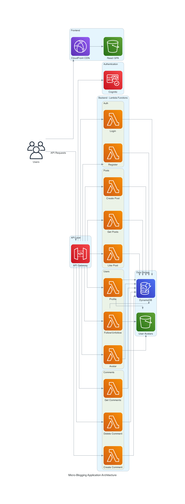
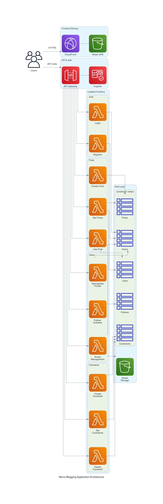

# Micro-Blogging Social Media App

A serverless micro-blogging social media application built on AWS. Users can create accounts, post short messages, follow other users, and interact with posts through likes and comments.



## Features

- 🔐 User authentication and profile management with AWS Cognito
- 📝 Post creation with character limits
- 👥 Social interactions (follow/unfollow users, like posts)
- 💬 Comment system with nested discussions
- 🖼️ Avatar upload and management
- 📊 Real-time feed with sorting options (recent, popular)
- 📱 Responsive design for mobile and desktop

## Architecture

Full-stack serverless application leveraging AWS services:

- **Frontend**: React 18 + TypeScript SPA hosted on S3/CloudFront
- **Backend**: Node.js 22.x Lambda functions with API Gateway
- **Database**: DynamoDB with Global Secondary Indexes
- **Authentication**: AWS Cognito for user management
- **Storage**: S3 for avatar images
- **CDN**: CloudFront for content delivery



## Tech Stack

### Frontend
- React 18 with TypeScript
- Vite for build tooling
- React Router for navigation
- ESLint for code quality
- Playwright for E2E testing

### Backend
- Node.js 22.x runtime (AWS Lambda)
- JavaScript (CommonJS modules)
- AWS SDK v3
- Jest for testing

### Infrastructure
- AWS CDK v2 with TypeScript
- CloudFormation for deployment

## Prerequisites

Before you begin, ensure you have the following installed:

- **Node.js** 18.x or later ([Download](https://nodejs.org/))
- **Yarn** 1.22.x or later (`npm install -g yarn`)
- **AWS CLI** 2.x ([Installation Guide](https://docs.aws.amazon.com/cli/latest/userguide/getting-started-install.html))
- **AWS CDK** 2.x (`npm install -g aws-cdk`)
- **AWS Account** with appropriate permissions

### AWS Permissions Required

Your AWS account/user needs permissions for:
- CloudFormation (stack creation/updates)
- Lambda (function creation/updates)
- API Gateway (REST API creation)
- DynamoDB (table creation)
- Cognito (user pool creation)
- S3 (bucket creation and file uploads)
- CloudFront (distribution creation)
- IAM (role creation for Lambda functions)

## Getting Started

### 1. Clone the Repository

```bash
git clone <repository-url>
cd micro-blogging-app
```

### 2. Install Dependencies

This project uses Yarn workspaces. Install all dependencies from the root:

```bash
yarn install
```

This will install dependencies for all three workspaces: frontend, backend, and infrastructure.

### 3. Configure AWS Credentials

Ensure your AWS CLI is configured with credentials:

```bash
aws configure
```

You'll need to provide:
- AWS Access Key ID
- AWS Secret Access Key
- Default region (e.g., `us-east-1`)
- Default output format (e.g., `json`)

Verify your configuration:

```bash
aws sts get-caller-identity
```

### 4. Bootstrap AWS CDK (First Time Only)

If this is your first time using CDK in this AWS account/region:

```bash
cdk bootstrap aws://ACCOUNT-ID/REGION
```

Replace `ACCOUNT-ID` with your AWS account ID and `REGION` with your target region.

### 5. Build the Backend

Prepare the Lambda function packages:

```bash
yarn build:backend
```

This copies the source files to `backend/dist/` and removes TypeScript files.

### 6. Deploy Infrastructure

Deploy the AWS infrastructure stack:

```bash
yarn deploy:infra
```

This will:
- Create DynamoDB tables
- Set up Cognito user pools
- Deploy Lambda functions
- Configure API Gateway
- Create S3 buckets
- Set up CloudFront distribution

**Important**: Save the CDK outputs displayed after deployment. You'll need these values for the frontend configuration.

Example output:
```
Outputs:
AppStack.ApiUrl = https://abc123.execute-api.us-east-1.amazonaws.com/prod
AppStack.UserPoolId = us-east-1_ABC123
AppStack.UserPoolClientId = 1a2b3c4d5e6f7g8h9i0j
AppStack.IdentityPoolId = us-east-1:12345678-1234-1234-1234-123456789012
AppStack.CloudFrontAvatarUrl = https://d111111abcdef8.cloudfront.net
AppStack.WebsiteBucketName = appstack-websitebucket-abc123
AppStack.CloudFrontDistributionId = E1234567890ABC
```

### 7. Configure Frontend Environment

Create the frontend environment file:

```bash
cd frontend
cp .env.example .env
```

Edit `frontend/.env` and fill in the values from the CDK outputs:

```env
VITE_API_URL=<ApiUrl from CDK output>
VITE_USER_POOL_ID=<UserPoolId from CDK output>
VITE_USER_POOL_CLIENT_ID=<UserPoolClientId from CDK output>
VITE_IDENTITY_POOL_ID=<IdentityPoolId from CDK output>
VITE_CLOUDFRONT_AVATAR_URL=<CloudFrontAvatarUrl from CDK output>
VITE_DEFAULT_AVATAR_URL=<CloudFrontAvatarUrl from CDK output>/default-avatar.png
```

### 8. Deploy Frontend

Build and deploy the frontend to S3:

```bash
cd ..  # Return to root directory
yarn deploy:frontend
```

This builds the React app and syncs it to the S3 bucket.

### 9. Invalidate CloudFront Cache

After deploying the frontend, invalidate the CloudFront cache:

```bash
yarn invalidate:cdn
```

### 10. Access Your Application

Your application is now live! Access it via the CloudFront URL from the CDK outputs:

```
https://<CloudFrontDistributionId>.cloudfront.net
```

You can also find this URL in the AWS Console under CloudFront distributions.

## Development Workflow

### Local Development

Start the frontend development server:

```bash
yarn start:frontend
```

The app will be available at `http://localhost:5173`

### Making Changes

#### Frontend Changes

1. Make your changes in `frontend/src/`
2. Test locally with `yarn start:frontend`
3. Deploy: `yarn deploy:frontend && yarn invalidate:cdn`

#### Backend Changes

1. Make your changes in `backend/src/`
2. Build: `yarn build:backend`
3. Deploy: `yarn deploy:infra`

#### Infrastructure Changes

1. Make your changes in `infrastructure/lib/`
2. Preview changes: `yarn workspace infrastructure cdk diff`
3. Deploy: `yarn deploy:infra`

### Full Deployment

To deploy everything at once:

```bash
yarn deploy
```

This runs: build backend → deploy infrastructure → build & deploy frontend → invalidate CDN

## Testing

### Frontend E2E Tests

```bash
# Run tests headless
yarn workspace frontend test:e2e

# Run tests with UI
yarn workspace frontend test:e2e:ui

# Run tests in headed mode
yarn workspace frontend test:e2e:headed
```

### Backend Unit Tests

```bash
yarn workspace backend test
```

## Project Structure

```
/
├── frontend/              # React SPA
│   ├── src/
│   │   ├── components/   # Reusable UI components
│   │   ├── contexts/     # React contexts (AuthContext)
│   │   ├── pages/        # Route-level components
│   │   ├── services/     # API client
│   │   └── types/        # TypeScript definitions
│   └── .env              # Environment variables (not in git)
│
├── backend/              # Lambda functions
│   ├── src/
│   │   ├── common/       # Shared middleware
│   │   └── functions/    # Lambda handlers
│   │       ├── auth/     # Authentication
│   │       ├── posts/    # Post management
│   │       ├── users/    # User profiles
│   │       └── comments/ # Comment system
│   └── dist/             # Build output (gitignored)
│
├── infrastructure/       # AWS CDK
│   └── lib/
│       └── app-stack.ts  # Main stack definition
│
└── package.json          # Workspace root
```

## API Endpoints

### Authentication
- `POST /auth/register` - Create new user account
- `POST /auth/login` - User login

### Users
- `GET /users/{userId}` - Get user profile
- `PUT /users/{userId}` - Update profile
- `POST /users/{userId}/follow` - Follow user
- `POST /users/{userId}/unfollow` - Unfollow user
- `GET /users/{userId}/following` - Check following status
- `GET /users/{userId}/avatar-upload-url` - Get presigned URL for avatar upload
- `PUT /users/{userId}/avatar` - Update avatar URL
- `DELETE /users/{userId}/avatar` - Delete avatar

### Posts
- `GET /posts` - Get feed (with sorting options)
- `POST /posts` - Create new post
- `POST /posts/{postId}/like` - Like/unlike post
- `GET /posts/{postId}/comments` - Get post comments

### Comments
- `POST /comments` - Create comment
- `DELETE /comments/{commentId}` - Delete comment

## Database Schema

### DynamoDB Tables

- **UsersTable**: User profiles and metadata
  - PK: `id`, GSI: `username-index`

- **PostsTable**: User posts
  - PK: `id`, GSI: `userId-index` (SK: `createdAt`)

- **LikesTable**: Post likes
  - PK: `userId`, SK: `postId`, GSI: `postId-index`

- **CommentsTable**: Post comments
  - PK: `id`, GSI: `postId-index` (SK: `createdAt`)

- **FollowsTable**: User relationships
  - PK: `followerId`, SK: `followeeId`, GSI: `followee-index`

## Troubleshooting

### CDK Deployment Fails

- Ensure AWS credentials are configured correctly
- Check you have sufficient permissions
- Verify CDK is bootstrapped: `cdk bootstrap`

### Frontend Can't Connect to API

- Verify `.env` file has correct values from CDK outputs
- Check API Gateway endpoint is accessible
- Ensure CORS is configured correctly (handled by CDK)

### Lambda Functions Failing

- Check CloudWatch Logs in AWS Console
- Verify environment variables are set correctly
- Ensure IAM roles have necessary permissions

### CloudFront Not Serving Latest Content

- Run cache invalidation: `yarn invalidate:cdn`
- Wait a few minutes for propagation

## Cleanup

To remove all AWS resources and avoid charges:

```bash
# Delete the CloudFormation stack
yarn workspace infrastructure cdk destroy

# Manually empty and delete S3 buckets if needed
aws s3 rm s3://<bucket-name> --recursive
aws s3 rb s3://<bucket-name>
```

**Note**: Some resources like CloudWatch Logs may persist and need manual deletion.

## Contributing

1. Create a feature branch
2. Make your changes
3. Test thoroughly
4. Submit a pull request

## License

This project is private and proprietary.

## Support

For issues or questions, please open an issue in the repository.
